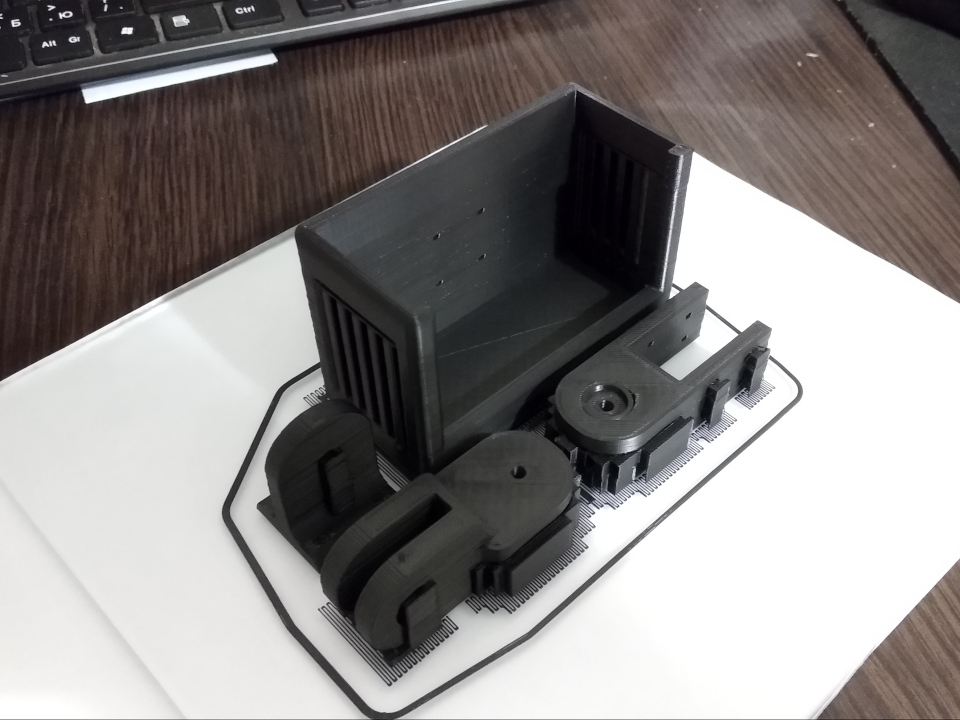

# Multimeter Holder

## Description  

Obviously, every electronics hobbyist has a multimeter. It's must to have tool should be always accessible whenever you
working on a new device or repairing old one. As any other tool, multimeter occupies some part of working space and in
some cases it's very important to have more clear space on your table. Here is where this project can help you. Using
this multimeter holder you can easily hang your tool on on a shelf or another part of your working environment. 

## Built Samples

## How To Use

- Open [STL-files](stl/) in your favourite slicer.
- Prepare models for printing.
- Slice and print.

## How To Customize Model

- Open [source 3D model](src/MultimeterHolder.f3d) in [Autodesk Fusion 360].
- Open "Parameters" dialog and set variables in "User Parameters" for your needs.
- Export STL models.
- Print.

## Built With

- [Autodesk Fusion 360].

## Contributing

Please read [CONTRIBUTING.md](CONTRIBUTING.md) for details.

## Versioning

I use [SemVer](http://semver.org/) for versioning. For the versions available, see the
[tags on this repository](https://github.com/ashep/multimeter-holder/tags).

## See also

- [Project on Thingiverse](https://www.thingiverse.com/thing:3948771).
- [Project on Hackster](https://www.hackster.io/ashep/multimeter-holder-5e9318).
 

## Authors

* [Oleksandr Shepetko](https://shepetko.com) -- initial work.

## License

This project is licensed under the MIT License. See the [LICENSE.md](LICENSE.md) file for details.

## Changelog

### 2019-10-31

Initial release.

[Autodesk Fusion 360]: https://www.autodesk.com/products/fusion-360/overview